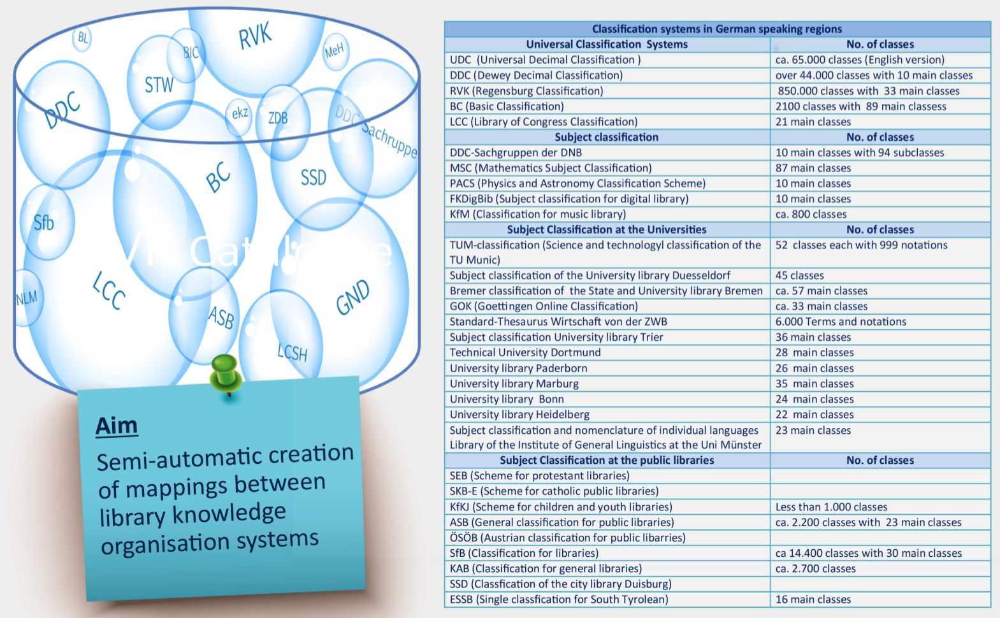
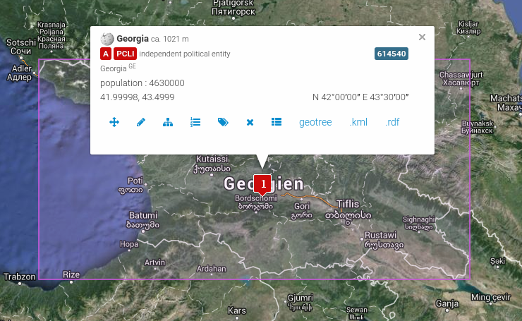
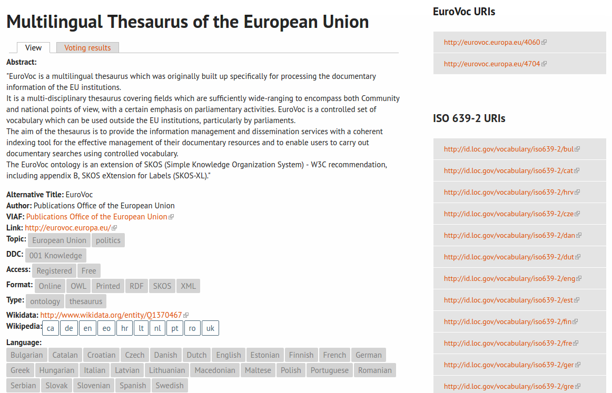

---
title: Uniform description and access to Knowledge Organization Systems with BARTOC and JSKOS
shorttitle: KOS description with BARTOC & JSKOS 
author: Andreas Ledl, Jakob Voß, Uma Balakrishnan
date: 2016-06-09
place: TOTh 2016 Conference, Chambéry
...

# JSKOS Knowledge Organization Systems format

## Project coli-conc

## JSKOS data format

Requirement: uniform access to KOS data

* based on RDF (SKOS & Dublin Core)\
  \ldots but more restrictive (unification)
* based on JSON-LD\
  \ldots extended by language ranges and closed world statements

main goal: **easy use of KOS data in web applications**

<https://gbv.github.io/jskos/>

## Concept example: GeoNames

## JSKOS concept example from GeoNames (abbreviated)

~~~json
{ 
  "uri": "http://sws.geonames.org/614540/",
  "inScheme": [ 
    { "uri": "http://bartoc.org/en/node/15" }
  ],
  "prefLabel": {
    "en": "Georgia",
    "fr": "Géorgie", 
    "de": "Georgien", 
    "-": "..."
  },
  "broader": [ 
    { "uri": "http://sws.geonames.org/6255147/" } 
  ],
  "narrower": [ ], ...
~~~

## BARTOC in JSKOS

KOS can also be expressed in JSKOS

* Mapping of BARTOC fields to JSKOS
* BARTOC JSKOS export available:\
  <https://github.com/gbv/bartoc-dumps/>

## BARTOC example: Eurovoc

## JSKOS BARTOC example: Eurovoc record (abbreviated)

~~~json
{
  "uri": "http://bartoc.org/en/node/15",
  "url": "http://eurovoc.europa.eu/",
  "identifier": [ 
     "http://www.wikidata.org/entity/Q1370467" 
  ],
  "prefLabel": {
    "en": "Multilingual Thesaurus of the European Union"
  },
  "altLabel": { "en": [ "EuroVoc" ] },
  "languages": [ "bg", "ca", "cs", "da", "de", "el",
                 "en", "es", "et", "fi", "fr", 
  ... 
~~~

## JSKOS-API

* specification of HTTP API to query KOS (in JSKOS)
* based on vocabulary services use cases
    * lookup of concept with known URI
    * search concepts with unknown URI
    * browsing in knowledge organization systems
    * query mappings
    * ...
* work in progress ([RDA Vocabulary Services Interest Group](https://rd-alliance.org/groups/interest-groups)?)

## JSKOS-API current state

* [Entity Lookup Microservice API (ELMA)](http://gbv.github.io/elma/)\
   as most relevant subset of JSKOS-API

    entity lookup
      : `?uri=http://sws.geonames.org/614540/`

    entity search
      : `?search=Georgia` (labels, scopeNotes...)

* public demo of terminology wrappers: 
  <https://jskos-php-examples.herokuapp.com/>\
  (BARTOC, Wikidata, GND, ORCID, GeoNames, VIAF \ldots)

# Applications

## Terminology Service 

## Mapping Database

## JSKOS mapping example

~~~json
{ 
  "creator": { "notation": [ "VZG" ] },
  "mappingMethod": "???",
  "fromScheme": {
     "uri": "http://bartoc.org/en/node/241",
     "notation": [ "DDC" ]
  },
  "from": { "members" : [
    { "uri:": "http://dewey.info/class/612.112" }
  ] },
  "toScheme" : {
     "uri": "http://bartoc.org/en/node/533",
     "notation": [ "RVK" ]
  },
  "to": { "members" : [
    { "uri": "http://uri.gbv.de/terminology/rvk/WW8844" }
  ] }
}
~~~

## Other possible applications

* semantic tagging of documents with identified concepts
  (e.g. <http://sws.geonames.org/614540/> instead of "Georgia")
* statistical analysis of terminologies
  (e.g. compare size in number of concepts, hierachy, density of links...)
* enrichment of concepts from multiple KOS
* \ldots

*foster the visibility, availability and usefulness of KOS in general*

## Thank you for attention

* Questions?

* Follow us on Twitter
    * [\@BARTOC_UBBasel](http://twitter.com/BARTOC_UBBasel)
    * [\@coli_conc](http://twitter.com/coli_conc)

* More information

    * <http://bartoc.org/>
    * <https://coli-conc.gbv.de/>
    * <https://gbv.github.io/jskos/>
    * <http://gbv.github.io/elma/>

*Feedback and contribution is appreciated!*

